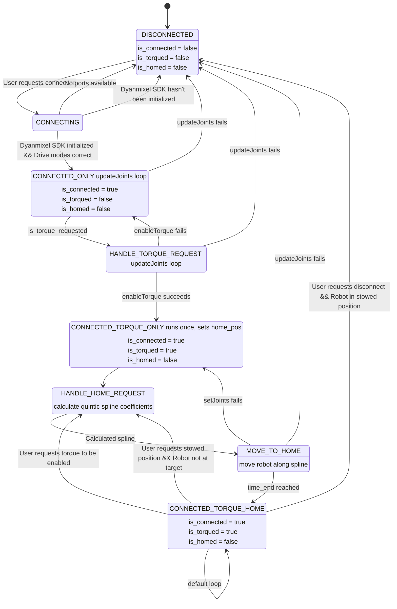

```mermaid
stateDiagram
  direction TB
  [*] --> STATE_DISCONNECTED
  STATE_DISCONNECTED --> STATE_CONNECTING:User requests connection
  STATE_CONNECTING --> STATE_DISCONNECTED:No ports available
  STATE_CONNECTING --> STATE_DISCONNECTED:Dyanmixel SDK hasn't been initialized
  STATE_CONNECTING --> STATE_CONNECTED_ONLY:Dyanmixel SDK initialized && Drive modes correct
  STATE_CONNECTED_ONLY --> STATE_DISCONNECTED:updateJoints fails
  STATE_CONNECTED_ONLY --> STATE_HANDLE_TORQUE_REQUEST:is_torque_requested
  STATE_HANDLE_TORQUE_REQUEST --> STATE_DISCONNECTED:updateJoints fails
  STATE_HANDLE_TORQUE_REQUEST --> STATE_CONNECTED_TORQUE_ONLY:enableTorque succeeds
  STATE_HANDLE_TORQUE_REQUEST --> STATE_CONNECTED_ONLY:enableTorque fails
  STATE_CONNECTED_TORQUE_ONLY --> STATE_HANDLE_HOME_REQUEST
  STATE_HANDLE_HOME_REQUEST --> STATE_MOVE_TO_HOME : Calculated spline
  STATE_MOVE_TO_HOME --> STATE_DISCONNECTED:updateJoints fails
  STATE_MOVE_TO_HOME --> STATE_CONNECTED_TORQUE_ONLY:setJoints fails
  STATE_MOVE_TO_HOME --> STATE_CONNECTED_TORQUE_HOME:time_end reached
  STATE_CONNECTED_TORQUE_HOME --> STATE_DISCONNECTED:User requests disconnect && Robot in stowed position
  STATE_CONNECTED_TORQUE_HOME --> STATE_HANDLE_HOME_REQUEST:User requests torque to be enabled
  STATE_CONNECTED_TORQUE_HOME --> STATE_HANDLE_HOME_REQUEST:User requests stowed position && Robot not at target
  STATE_CONNECTED_TORQUE_HOME --> STATE_CONNECTED_TORQUE_HOME:default loop
  STATE_DISCONNECTED:DISCONNECTED
STATE_DISCONNECTED:is_connected = false
STATE_DISCONNECTED:is_torqued = false
STATE_DISCONNECTED:is_homed = false
  STATE_CONNECTING:CONNECTING
  STATE_CONNECTED_ONLY:CONNECTED_ONLY updateJoints loop
STATE_CONNECTED_ONLY:is_connected = true
STATE_CONNECTED_ONLY:is_torqued = false
STATE_CONNECTED_ONLY:is_homed = false
  STATE_HANDLE_TORQUE_REQUEST:HANDLE_TORQUE_REQUEST updateJoints loop
  STATE_CONNECTED_TORQUE_ONLY:CONNECTED_TORQUE_ONLY runs once, sets home_pos
STATE_CONNECTED_TORQUE_ONLY:is_connected = true
STATE_CONNECTED_TORQUE_ONLY:is_torqued = true
STATE_CONNECTED_TORQUE_ONLY:is_homed = false
  STATE_HANDLE_HOME_REQUEST:HANDLE_HOME_REQUEST
STATE_HANDLE_HOME_REQUEST:calculate quintic spline coefficients
  STATE_MOVE_TO_HOME:MOVE_TO_HOME
STATE_MOVE_TO_HOME:move robot along spline
  STATE_CONNECTED_TORQUE_HOME:CONNECTED_TORQUE_HOME
STATE_CONNECTED_TORQUE_HOME:is_connected = true
STATE_CONNECTED_TORQUE_HOME:is_torqued = true
STATE_CONNECTED_TORQUE_HOME:is_homed = false
```